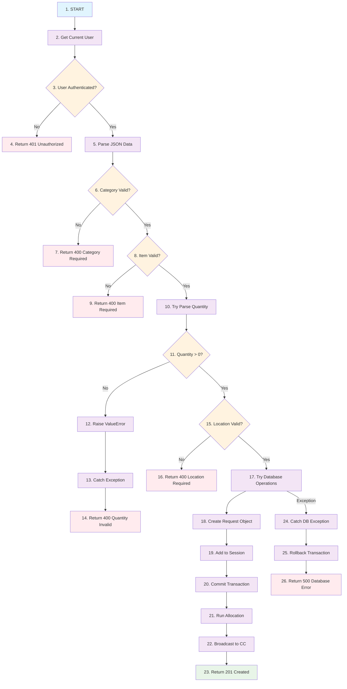
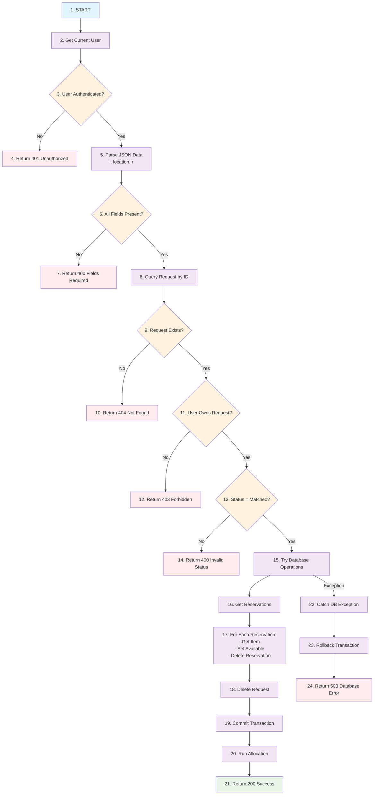
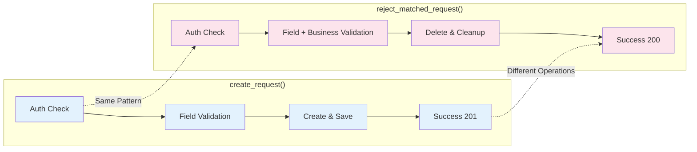
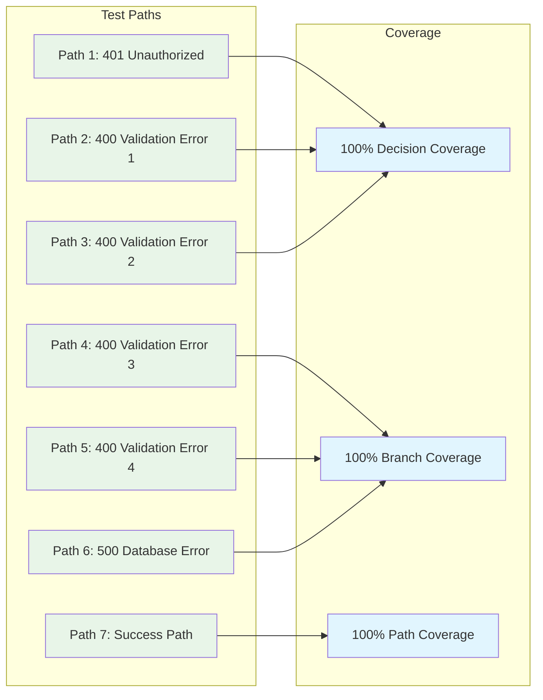

# Mermaid Control Flow Graphs

## create_request() Method Control Flow



## reject_matched_request() Method Control Flow



## Side-by-Side Comparison



## Cyclomatic Complexity Visualization

```mermaid
graph TD
    subgraph "Decision Points Analysis"
        A[Entry Point] --> B[Decision 1: Auth]
        B --> C[Decision 2: Validation 1]
        C --> D[Decision 3: Validation 2]
        D --> E[Decision 4: Validation 3]
        E --> F[Decision 5: Validation 4]
        F --> G[Decision 6: Exception Handling]
        G --> H[Exit Points]
    end
    
    I[Cyclomatic Complexity<br/>V(G) = E - N + 2P<br/>V(G) = 6 + 1 = 7]
    
    classDef complexity fill:#fff9c4
    class I complexity
```

## Path Coverage Matrix

