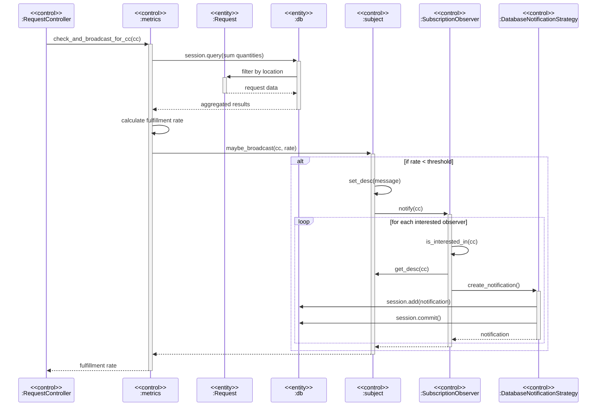

```mermaid
sequenceDiagram
    participant RC as <<control>><br/>:RequestController
    participant M as <<control>><br/>:metrics
    participant R as <<entity>><br/>:Request
    participant DB as <<entity>><br/>:db
    participant S as <<control>><br/>:subject
    participant SO as <<control>><br/>:SubscriptionObserver
    participant DNS as <<control>><br/>:DatabaseNotificationStrategy

    RC->>+M: check_and_broadcast_for_cc(cc)
    
    M->>+DB: session.query(sum quantities)
    DB->>+R: filter by location
    R-->>-DB: request data
    DB-->>-M: aggregated results
    
    M->>M: calculate fulfillment rate
    
    M->>+S: maybe_broadcast(cc, rate)
    
    alt if rate < threshold
        S->>S: set_desc(message)
        S->>+SO: notify(cc)
        
        loop for each interested observer
            SO->>SO: is_interested_in(cc)
            SO->>S: get_desc(cc)
            SO->>+DNS: create_notification()
            DNS->>DB: session.add(notification)
            DNS->>DB: session.commit()
            DNS-->>-SO: notification
        end
        
        SO-->>-S: 
    end
    
    S-->>-M: 
    M-->>-RC: fulfillment rate
```