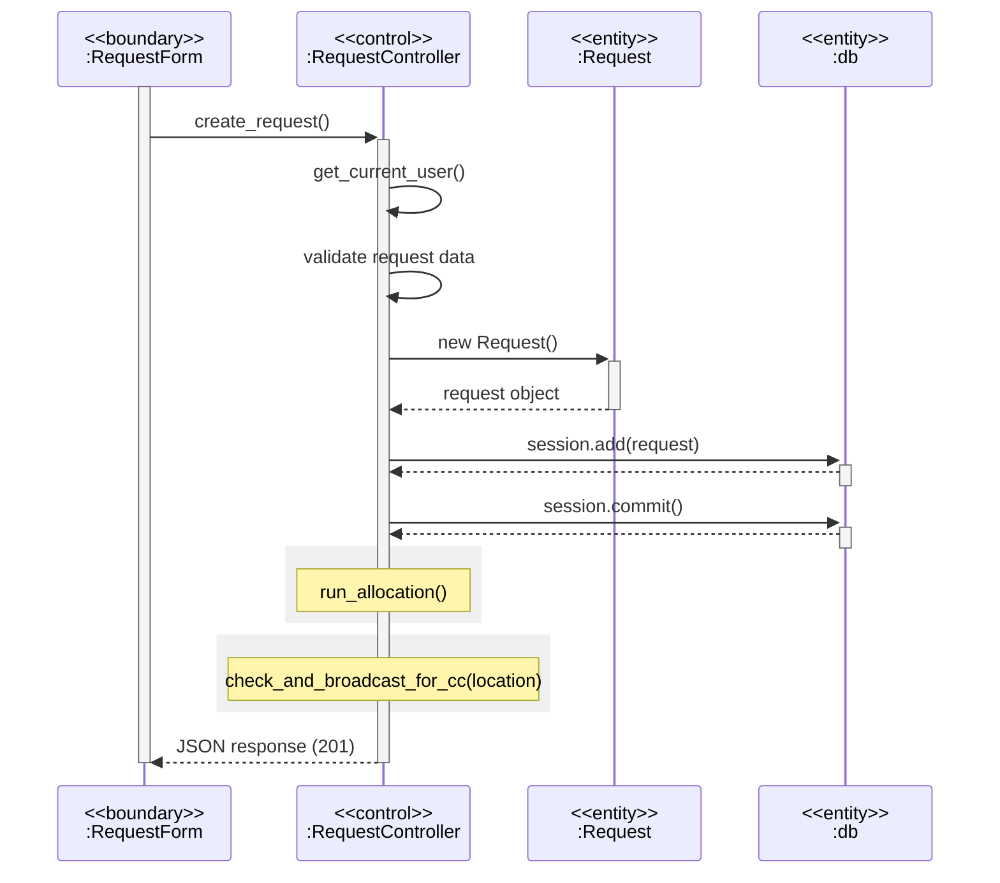

```mermaid
sequenceDiagram
    participant RF as <<boundary>><br/>:RequestForm
    participant RC as <<control>><br/>:RequestController
    participant R as <<entity>><br/>:Request
    participant DB as <<entity>><br/>:db

    activate RF
    RF->>+RC: create_request()
    
    RC->>RC: get_current_user()
    RC->>RC: validate request data
    
    RC->>+R: new Request()
    R-->>-RC: request object
    
    RC->>+DB: session.add(request)
    DB-->>-RC: 
    
    RC->>+DB: session.commit()
    DB-->>-RC: 
    
    rect rgb(240, 240, 240)
        note over RC: run_allocation()
    end
    
    rect rgb(240, 240, 240)
        note over RC: check_and_broadcast_for_cc(location)
    end
    
    RC-->>-RF: JSON response (201)
    deactivate RF
```