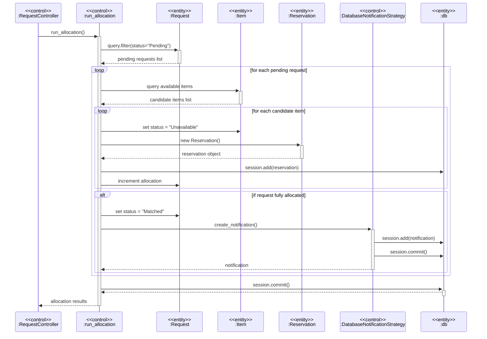

```mermaid
sequenceDiagram
    participant RC as <<control>><br/>:RequestController
    participant RA as <<control>><br/>:run_allocation
    participant R as <<entity>><br/>:Request
    participant I as <<entity>><br/>:Item
    participant RES as <<entity>><br/>:Reservation
    participant DNS as <<control>><br/>:DatabaseNotificationStrategy
    participant DB as <<entity>><br/>:db

    RC->>+RA: run_allocation()
    
    RA->>+R: query.filter(status="Pending")
    R-->>-RA: pending requests list
    
    loop for each pending request
        RA->>+I: query available items
        I-->>-RA: candidate items list
        
        loop for each candidate item
            RA->>I: set status = "Unavailable"
            RA->>+RES: new Reservation()
            RES-->>-RA: reservation object
            RA->>DB: session.add(reservation)
            RA->>R: increment allocation
        end
        
        alt if request fully allocated
            RA->>R: set status = "Matched"
            RA->>+DNS: create_notification()
            DNS->>DB: session.add(notification)
            DNS->>DB: session.commit()
            DNS-->>-RA: notification
        end
    end
    
    RA->>+DB: session.commit()
    DB-->>-RA: 
    
    RA-->>-RC: allocation results
```